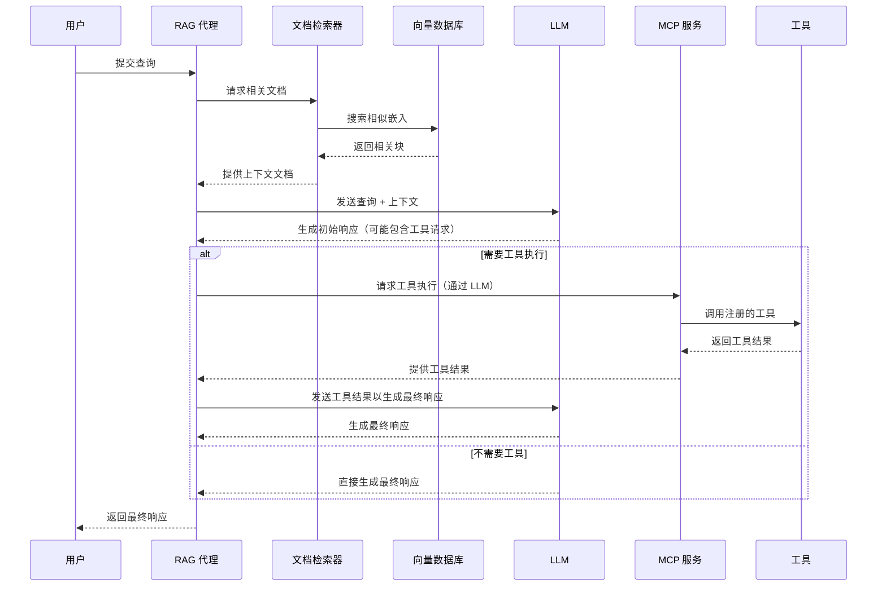

# LLM-MCP-RAG-JS 项目介绍

---

## 幻灯片 1: MCP 介绍与背景

### **什么是 MCP (模型上下文协议)?**
- 🚀 一个开放协议，使 LLM 能够安全地调用外部工具和 API
- 🔄 旨在标准化和简化 LLM 与外部能力的交互
- 🧩 将模型提供商与工具提供商分离，创建可扩展的生态系统

### **MCP 的优势**
- **标准化**: 为所有 LLM-工具交互提供通用接口
- **安全性**: 通过权限管理控制工具执行
- **可扩展性**: 轻松添加新工具而无需更改核心 LLM 实现
- **互操作性**: 工具可在不同的 LLM 提供商之间工作

---

## 幻灯片 2: 项目概述

### **什么是 LLM-MCP-RAG-JS?**
- 🧠 一个用于集成 **LLM** 和 **MCP** 的模块化框架
- 📚 专为 **检索增强生成 (RAG)** 工作流设计
- ⚡ 使用 **TypeScript** 和 **Node.js** 构建

### **项目目标**
- 简化 LLM-工具集成
- 提供强大的 RAG 实现
- 实现安全且可扩展的 AI 应用

---

## 幻灯片 3: 主要特性

### **核心功能**
- **MCP 服务**: 与 MCP 服务器通信，用于工具注册和执行
- **文档检索**: 加载、向量化和搜索文档以获取上下文
- **RAG 代理**: 结合 LLM 和文档检索，生成上下文增强的响应

### **高级能力**
- 🔄 实时文档处理
- 🔍 语义搜索能力
- 🛡️ 安全的工具执行
- 📊 性能监控（计划中）

---

## 幻灯片 4: 架构概述

### **系统架构**
```mermaid
graph TD
    A[用户查询] --> B(RAG 代理);
    B --> C{文档检索};
    B --> D{MCP 服务};
    C --> E[(向量数据库)];
    D --> F[外部工具];
    B --> G{LLM};
    G --> H[生成响应];
    H --> B; // LLM 响应可能反馈给代理
    B --> I[最终输出];
```

### **目录结构**
```text
src/
├── core/          # 核心业务逻辑 (RAGAgent)
├── protocol/      # MCP 协议实现 (MCPService)
├── retrieval/     # 文档检索逻辑 (DocumentRetriever)
├── utils/         # 工具函数
└── config/        # 配置文件
```

---

## 幻灯片 5: 核心组件

### **1. MCP 服务**
- 实现模型上下文协议规范
- 管理与 MCP 服务器的通信
- 处理工具注册、发现和调用
- 管理认证和权限
- 包含错误处理和重试机制

### **2. 文档检索**
- 加载和处理文档（分块）
- 生成嵌入向量（如使用 OpenAI）
- 通过向量数据库存储和检索嵌入
- 支持相似性搜索

### **3. RAG 代理**
- 协调工作流程
- 接收用户查询和检索的上下文
- 与 LLM 交互生成内容
- 集成 MCP 服务以使用工具

---

## 幻灯片 6: 技术栈

### **技术栈**
- **运行时**: Node.js (>= 18)
- **语言**: TypeScript
- **包管理器**: pnpm (>= 10.6.3)
- **主要依赖**:
  - `@modelcontextprotocol/sdk`: 用于 MCP 集成
  - `openai`: 用于 LLM 交互和嵌入
  - `zod`: 用于模式验证
  - `dotenv`: 用于环境配置
  - *(向量数据库库 - 如 ChromaDB, Pinecone)*

### **开发工具**
- 🧪 Jest 用于测试
- 📦 pnpm 用于包管理
- 🔍 ESLint / Prettier 用于代码质量
- 📝 TypeScript 用于类型安全

---

## 幻灯片 7: 配置与设置

### **环境要求**
- Node.js >= 18
- pnpm >= 10.6.3

### **设置步骤**
1. 克隆仓库
2. 安装依赖:
   ```bash
   pnpm install
   ```
3. 配置 `.env` 文件:
   ```env
   # 嵌入 API 详情
   EMBEDDING_BASE_URL=...
   EMBEDDING_KEY=...
   # LLM API 详情
   OPENAI_BASE_URL=...
   OPENAI_API_KEY=...
   # (添加其他必要配置，如向量数据库连接)
   ```
4. 运行开发服务器:
   ```bash
   pnpm dev
   ```

---

## 幻灯片 8: 工作流程

### **工作原理 (RAG + MCP)**


---

## 幻灯片 9: 示例代码与应用场景

### **使用 RAG 代理**
```typescript
import { MCPService } from './protocol/MCPService';
import { DocumentRetriever } from './retrieval/DocumentRetriever';
import { RAGAgent } from './core/RAGAgent';

// 初始化服务
const mcpService = new MCPService(/* 配置 */);
await mcpService.initialize();

const retriever = new DocumentRetriever(/* 配置 */);
await retriever.loadDocuments('./knowledge'); // 加载数据

// 创建并使用代理
const agent = new RAGAgent(mcpService, retriever /*, llmClient */);
const response = await agent.process('如何使用 MCP 进行文件操作？');

console.log(response);
```

### **实际应用场景**
- 📚 **智能文档问答系统**: 基于技术文档或内部知识库回答问题
- 🤖 **客户支持聊天机器人**: 使用 FAQ 和历史工单提供上下文感知的支持
- 🔍 **研究助手**: 总结和查询研究论文或文章
- 📊 **数据分析界面**: 允许使用自然语言查询与数据分析工具交互

---

## 幻灯片 10: 改进与未来工作

### **计划中的增强功能**
1.  **错误处理**: 更细粒度的错误类型和健壮的重试策略
2.  **性能优化**: 嵌入/检索的缓存和批处理
3.  **可观测性**: 详细日志（如 OpenTelemetry）和性能指标
4.  **向量数据库**: 集成特定向量数据库客户端（ChromaDB、Pinecone 等）
5.  **测试**: 提高测试覆盖率（单元测试、集成测试）

### **未来路线图**
- 🚀 支持更多 LLM 提供商（Anthropic、Gemini 等）
- 🔄 增强工具集成和发现功能
- 📊 高级 RAG 策略（如查询转换、重新排序）
- 🛡️ 改进工具执行的安全性
- 🌐 可能的配置和监控 UI

---

## 幻灯片 11: 总结

### **为什么选择 LLM-MCP-RAG-JS?**
- 🧩 **模块化与可扩展**: 轻松适应或扩展组件
- 🔄 **标准化工具**: 利用 MCP 实现安全、可互操作的工具使用
- 📚 **强大的 RAG**: 有效结合 LLM 与外部知识
- ⚡ **现代技术**: 使用 TypeScript/Node.js 实现性能和类型安全
- 🎯 **解决实际问题**: 适合构建需要外部上下文和操作的复杂 AI 应用

---

## 幻灯片 12: 感谢！

### **有问题吗？**

- **GitHub 仓库:** [LLM-MCP-RAG-JS](https://github.com/sunpcm/llm-mcp-rag-js)
- **Python 版本:** [LLM-MCP-RAG-Python](https://github.com/sunpcm/llm-mcp-rag-python)
