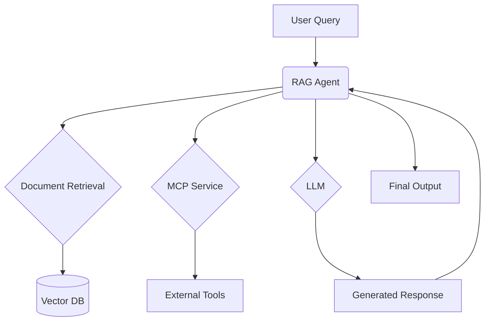
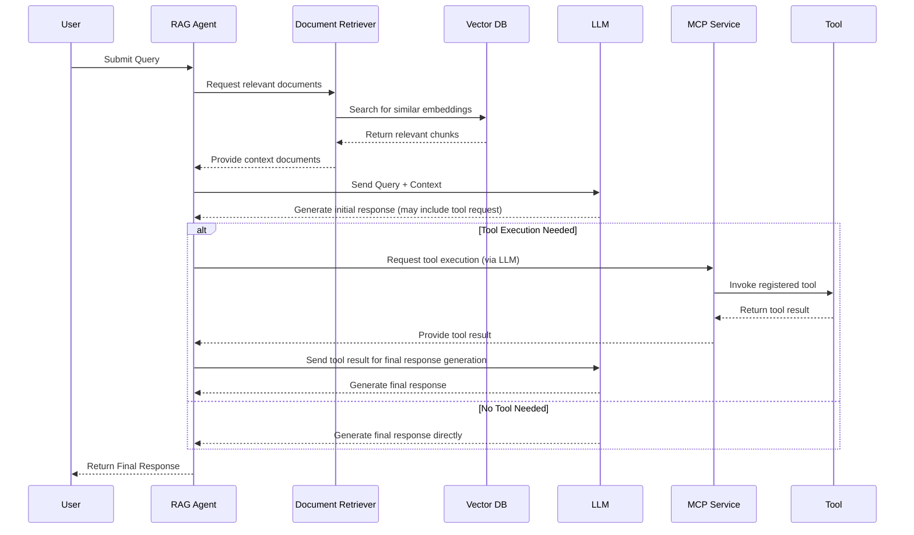

# LLM-MCP-RAG-JS Project Presentation

---

## Slide 1: MCP Introduction and Background

### **What is MCP (Model Context Protocol)?**
- 🚀 An open protocol that enables LLMs to call external tools and APIs securely
- 🔄 Created to standardize and simplify interactions between LLMs and external capabilitiesr
- 🧩 Separates model providers from tool providers, creating an extensible ecosystem

### **MCP Benefits**
- **Standardization**: Common interface for all LLM-tool interactions
- **Security**: Controlled execution of tools with permission management
- **Extensibility**: Easily add new tools without changing the core LLM implementation
- **Interoperability**: Tools work across different LLM providers

---

## Slide 2: Project Overview

### **What is LLM-MCP-RAG-JS?**
- 🧠 A modular framework for integrating **LLMs** with **MCP**
- 📚 Designed for **retrieval-augmented generation (RAG)** workflows
- ⚡ Built with **TypeScript** and **Node.js**

### **Project Goals**
- Simplify LLM-tool integration
- Provide a robust RAG implementation
- Enable secure and scalable AI applications

---

## Slide 3: Key Features

### **Core Features**
- **MCP Service**: Communication with MCP servers for tool registration and execution
- **Document Retrieval**: Load, vectorize, and search documents for context
- **RAG Agent**: Combines LLMs and document retrieval for context-enhanced responses

### **Advanced Capabilities**
- 🔄 Real-time document processing
- 🔍 Semantic search capabilities
- 🛡️ Secure tool execution
- 📊 Performance monitoring (Planned)

---

## Slide 4: Architecture Overview

### **System Architecture**


### **Directory Structure**
```text
src/
├── core/          # Core business logic (RAGAgent)
├── protocol/      # MCP protocol implementation (MCPService)
├── retrieval/     # Document retrieval logic (DocumentRetriever)
├── utils/         # Utility functions
└── config/        # Configuration files
```

---

## Slide 5: Core Components

### **1. MCP Service**
- Implements the Model Context Protocol spec
- Manages communication with MCP servers
- Handles tool registration, discovery & invocation
- Manages authentication & permissions
- Includes error handling & retry mechanisms

### **2. Document Retrieval**
- Loads & processes documents (chunking)
- Generates embeddings (e.g., OpenAI)
- Stores & retrieves embeddings via Vector DB
- Supports similarity search

### **3. RAG Agent**
- Orchestrates the workflow
- Takes user query + retrieved context
- Interacts with LLM for generation
- Integrates with MCP Service for tool use

---

## Slide 6: Technology Stack

### **Tech Stack**
- **Runtime**: Node.js (>= 18)
- **Language**: TypeScript
- **Package Manager**: pnpm (>= 10.6.3)
- **Key Dependencies**:
  - `@modelcontextprotocol/sdk`: For MCP integration
  - `openai`: For LLM interaction & embeddings
  - `zod`: For schema validation
  - `dotenv`: For environment configuration
  - *(Vector DB library - e.g., ChromaDB, Pinecone)*

### **Development Tools**
- 🧪 Jest for testing
- 📦 pnpm for package management
- 🔍 ESLint / Prettier for code quality
- 📝 TypeScript for type safety

---

## Slide 7: Configuration and Setup

### **Environment Requirements**
- Node.js >= 18
- pnpm >= 10.6.3

### **Setup Steps**
1. Clone the repository
2. Install dependencies:
   ```bash
   pnpm install
   ```
3. Configure `.env` file:
   ```bash
   # Embedding API details
   EMBEDDING_BASE_URL=...
   EMBEDDING_KEY=...
   # LLM API details
   OPENAI_BASE_URL=...
   OPENAI_API_KEY=...
   # (Add other necessary configs like Vector DB connection)
   ```
4. Run the development server:
   ```bash
   pnpm dev
   ```

---

## Slide 8: Workflow

### **How It Works (RAG + MCP)**


---

## Slide 9: Example Code & Use Cases

### **Using the RAG Agent**
```typescript
import { MCPService } from './protocol/MCPService';
import { DocumentRetriever } from './retrieval/DocumentRetriever';
import { RAGAgent } from './core/RAGAgent';

// Initialize services
const mcpService = new MCPService(/* config */);
await mcpService.initialize();

const retriever = new DocumentRetriever(/* config */);
await retriever.loadDocuments('./knowledge'); // Load your data

// Create and use the agent
const agent = new RAGAgent(mcpService, retriever /*, llmClient */);
const response = await agent.process('How can I use MCP for file operations?');

console.log(response);
```

### **Real-world Use Cases**
- 📚 **Intelligent Documentation Q&A:** Answer questions based on technical docs or internal knowledge bases.
- 🤖 **Customer Support Chatbots:** Provide context-aware support using FAQs and past tickets.
- 🔍 **Research Assistant:** Summarize and query research papers or articles.
- 📊 **Data Analysis Interface:** Allow natural language queries to interact with data analysis tools.

---

## Slide 10: Improvements and Future Work

### **Planned Enhancements**
1.  **Error Handling**: More granular error types & robust retry strategies.
2.  **Performance**: Caching, batch processing for embeddings/retrieval.
3.  **Observability**: Detailed logging (e.g., OpenTelemetry), performance metrics.
4.  **Vector DB**: Integrate specific vector DB clients (ChromaDB, Pinecone, etc.).
5.  **Testing**: Increase test coverage (unit, integration).

### **Future Roadmap**
- 🚀 Support for more LLM providers (Anthropic, Gemini, etc.).
- 🔄 Enhanced tool integration & discovery features.
- 📊 Advanced RAG strategies (e.g., query transformation, re-ranking).
- 🛡️ Improved security hardening for tool execution.
- 🌐 Potential UI for configuration and monitoring.

---

## Slide 11: Summary

### **Why LLM-MCP-RAG-JS?**
- 🧩 **Modular & Extensible:** Easily adapt or extend components.
- 🔄 **Standardized Tooling:** Leverages MCP for secure, interoperable tool use.
- 📚 **Powerful RAG:** Combines LLMs with external knowledge effectively.
- ⚡ **Modern Tech:** Built with TypeScript/Node.js for performance and type safety.
- 🎯 **Solves Real Problems:** Ideal for building sophisticated AI applications needing external context and actions.

---

## Slide 12: Thank You!

### **Questions?**

- **GitHub Repo:** [LLM-MCP-RAG-JS](https://github.com/sunpcm/llm-mcp-rag-js)
- **Python Version:** [LLM-MCP-RAG-Python](https://github.com/sunpcm/llm-mcp-rag-python)
